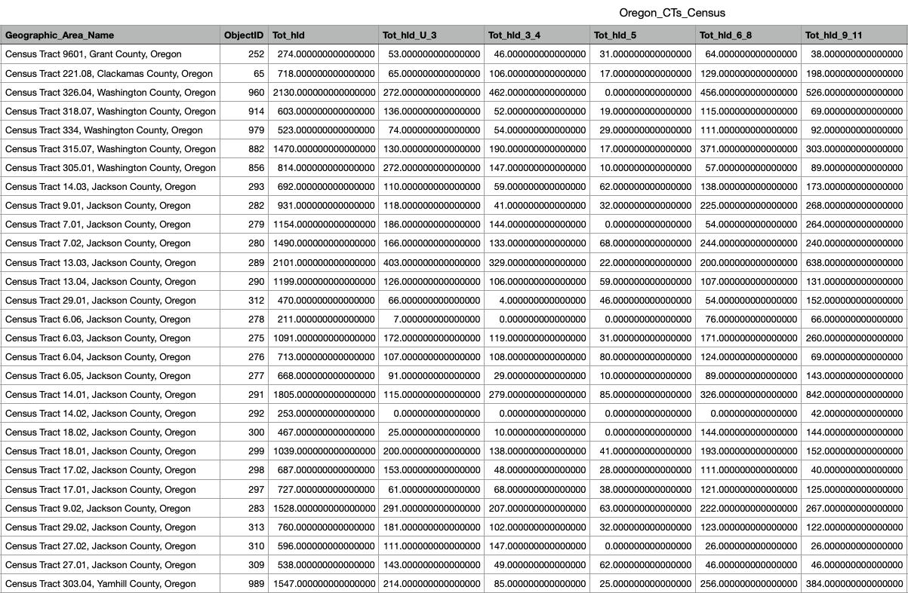
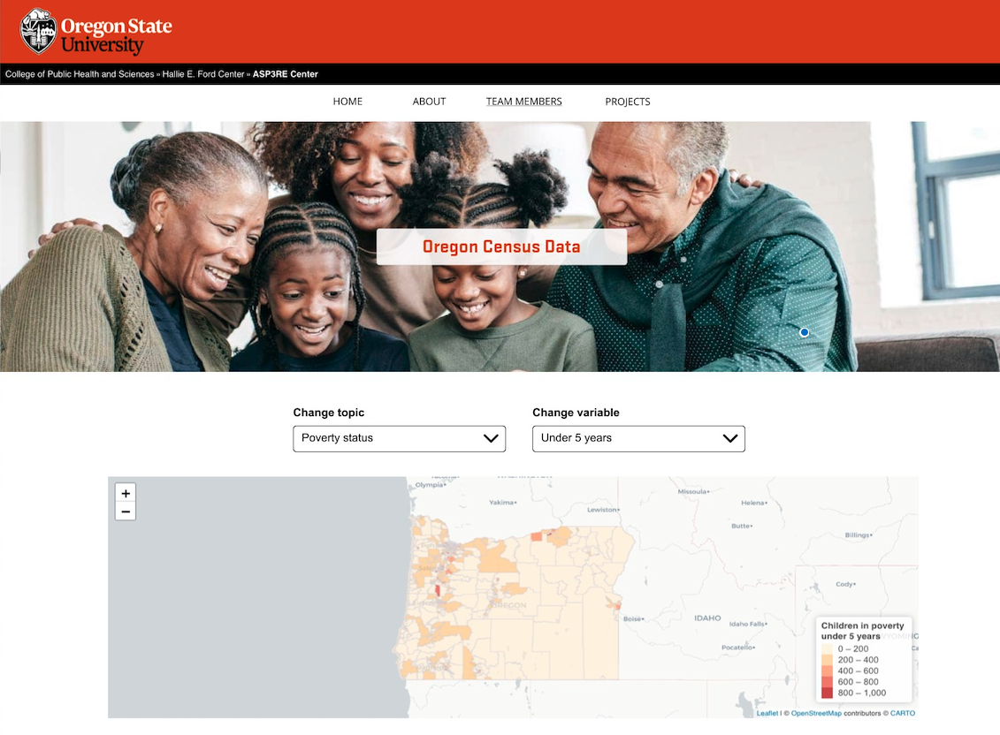
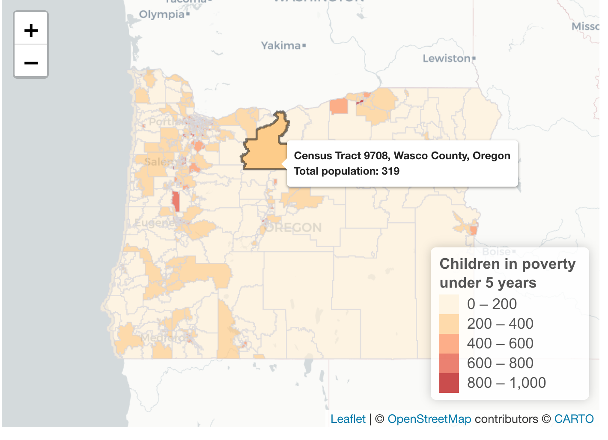
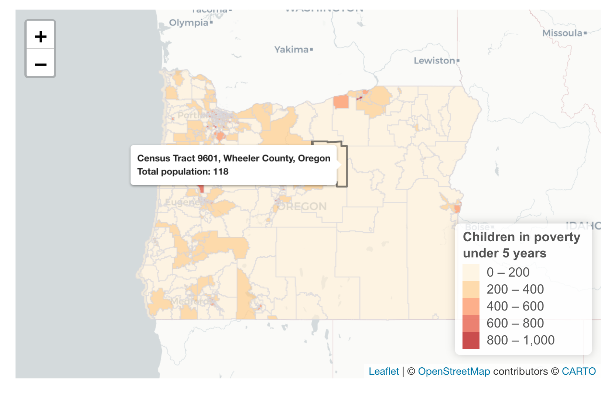
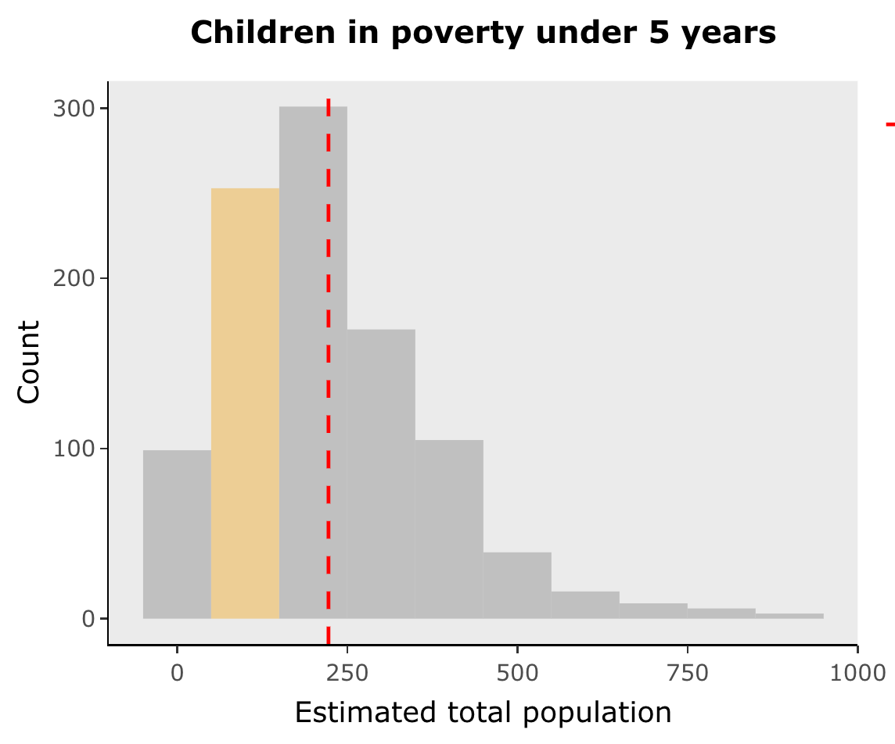
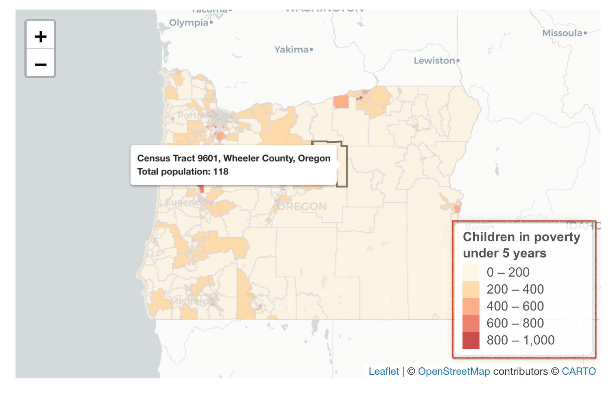

# ASP³IRE Website
Our ASP3IRE website utilizes interactive visualization techniques to enhance data exploration. Our key features include hover-over functionality, which provides detailed information when users interact with maps, as well as a highlight-on-click feature that allows users to uncover insights within the data. Additionally, we employ dynamic text boxes that appear upon user interaction. Our goal is to present data in an engaging manner while effectively conveying complex spatial and temporal information.

## Information
**Author**: [Kathleen Ashley](https://www.linkedin.com/in/kthashley/)

**Affiliation**: Oregon State University, ASP³IRE Children's Environmental Health, College of Public Health and Human Sciences

**Principal Investigator**: [Perry Hystad](https://health.oregonstate.edu/people/perry-hystad)

**Date last modified**: September 8th 2023

## **Summary**
This GitHub repository contains the code to create an R Shiny website with interactive visualizations (Map data visualization and interactive histograms) that were created using R packages.

## **R Packages**

This project uses the following R packages:

* [shinyscreenshot](https://github.com/daattali/shinyscreenshot)
* [fresh](https://github.com/wch/fresh)
* [plotly](https://plotly.com/r/)
* [plyr](https://cran.r-project.org/package=plyr)
* [raster](https://cran.r-project.org/package=raster)
* [tigris](https://cran.r-project.org/package=tigris)
* [sf](https://cran.r-project.org/package=sf)
* [htmltools](https://cran.r-project.org/package=htmltools)
* [htmlwidgets](https://cran.r-project.org/package=htmlwidgets)
* [leaflet](https://cran.r-project.org/package=leaflet)
* [shinyjs](https://cran.r-project.org/package=shinyjs)
* [shinythemes](https://cran.r-project.org/package=shinythemes)
* [forcats](https://cran.r-project.org/package=forcats)
* [stringr](https://cran.r-project.org/package=stringr)
* [dplyr](https://cran.r-project.org/package=dplyr)
* [purrr](https://cran.r-project.org/package=purrr)
* [readr](https://cran.r-project.org/package=readr)
* [tidyr](https://cran.r-project.org/package=tidyr)
* [tibble](https://cran.r-project.org/package=tibble)
* [ggplot2](https://cran.r-project.org/package=ggplot2)
* [tidyverse](https://tidyverse.org/)
* [shiny.router](https://github.com/daattali/shiny.router)
* [shiny](https://shiny.rstudio.com/)
* [mapview](https://r-spatial.github.io/mapview/)
* [sp](https://cran.r-project.org/package=sp)

These packages can also be downloaded through R by using this command:

    library(c("shiny", "tidyverse", "shiny.router", "shinythemes", "shinyjs", "leaflet", "htmlwidgets", "tigris", "raster", "plyr", "dplyr", "plotly", "fresh", "shinyscreenshot"))
    
## **Tools**
- **R Studio**

    R Studio is an integrated development environment (IDE) for R. It provides a graphical user interface (GUI) for writing R code, debugging, and running R scripts. You can download R Studio from the [R Studio website](https://rstudio.com/products/rstudio/download/).

- **R Packages**

    The R Packages above is used to develop this project, to be able to run this project locally, make sure to follow the steps listed on the section above.


## **How to Fork This Repository**
If you would like to contribute to this project or create your own customized version, follow these steps to fork the repository:

1. Click the **Fork** button at the top right of this repository's page. This action will create a copy of the entire repository in your GitHub account.

2. Once you have forked the repository, you can clone your forked version to your local machine using Git. Open your terminal and run the following command, replacing `<your-username>` with your GitHub username:

   ```shell
   git clone https://github.com/<your-username>/ASP3IRE_website.git

3. After cloning the repository, you can navigate to the project directory:
    ```shell
    cd ASP3IRE_website

4. Now you can make changes, enhancements, or customizations to the code!

## **Start on Project**
1. After downloading R, make sure to have the necessary packages installed by running this command:

        library(c("shiny", "tidyverse", "shiny.router", "shinythemes", "shinyjs", "leaflet", "htmlwidgets", "tigris", "raster", "plyr", "dplyr", "plotly", "fresh", "shinyscreenshot"))
  
2. Afterwards, open the following files for easy access to manipulate the website:

        global.R
        server.R
        ui.R
        webpages.R
3. Navigate to either ui.R, global.R, or server.R, then run the program by clicking the ‘Run app’ button in the upper right-hand corner of the screen.

## **Features**

### Data Automation
Automatically fetches data from .csv files and dynamically presents it on the website for user interaction. This feature loads data, creates maps, and visualizations based on the provided data, and calculates summary statistics for ease.



### Organized Datasets
Datasets are categorized and neatly organized, allowing users to effortlessly switch between different topics with a single click.



### Hover-Over Feature
A pop-up box dynamically appears when a user hovers over an area on the map, displaying pertinent information based on the selected geographical area and category.




### Highlight-on-Click Feature
The highlight-on-click feature provides users with insights into trends within a particular area compared to other geographical regions on the map, using interactive histograms. This feature also identifies areas with higher health exposures or risks in Oregon.




### Map Color Gradients
The map's color scheme and the legend located in the bottom right corner visually represent the spatial distribution of environmental exposures for each location.



    

## **Additional Resources**  
#### Hands-on Programming with R
This comprehensive book is an excellent resource for anyone looking to grasp the fundamental concepts of R programming, especially if you are new to the language. It provided invaluable insights and guidance during my initial months of working with R. If you are starting from scratch with R, I highly recommend beginning here. You can access the PDF version of the book [here](https://web.itu.edu.tr/~tokerem/Hands-On_R.pdf).

#### Interactive Visualization Tutorials
##### [Interactive Map of 2019 Covid Spread using R Shiny Tutorial](https://www.youtube.com/watch?v=eIpiL6y1oQQ)
This tutorial serves as a step-by-step guide to creating interactive maps using R Shiny. If you're interested in understanding how the interactive maps on the website were developed, I recommend watching this tutorial. It will help you gain insights into the techniques used to build engaging and interactive data visualizations.

#### StackOverflow
Most of the maps featured on the website were developed through a process of trial and error, as well as by seeking answers to specific questions on platforms like Stack Overflow. I recommend adopting a proactive approach by using search engines to find answers to any questions or challenges you encounter while working with R. Chances are, someone else has faced a similar issue and shared their solution.

#### [Mastering Shiny](https://mastering-shiny.org/basic-app.html)
The "Mastering Shiny" website offers a wealth of step-by-step guides for creating your first R Shiny applications. This resource was particularly valuable in helping me become familiar with the R Shiny environment, understanding the structure of R Shiny projects, and identifying the relevant packages to use for various project requirements. Whether you are a beginner or looking to enhance your Shiny skills, this resource is a valuable reference.

#### Media Queries
For responsive design and ensuring your web applications look and function well on different devices and screen sizes, mastering media queries is essential. These queries allow you to apply specific styles to your web content based on the user's device characteristics. To create professional and visually appealing web applications, consider learning more about media queries and their implementation.

Feel free to explore these resources to enhance your R programming and interactive data visualization skills. They will help you develop a strong foundation and become proficient in creating impactful data-driven applications.

- [Using media queries](https://developer.mozilla.org/en-US/docs/Web/CSS/CSS_media_queries/Using_media_queries)
- [Media Queries example](https://www.w3schools.com/css/css3_mediaqueries_ex.asp)


## **External Links**
  - [Oregon Census Data](https://example-link-here)
