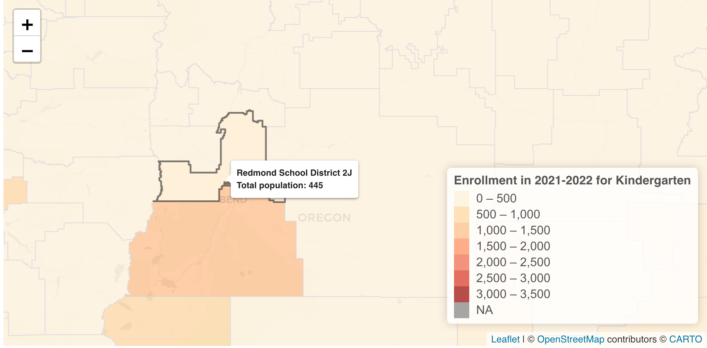

# ASP3IRE Website
Web data visualizations for ASP3IRE

## Information
**Author**: Kathleen Ashley
**Affiliation**: Oregon State University, ASP3IRE Children's Environmental Health, College of Public Health and Human Sciences
**Principal Investigator**: Perry Hystad
**Date last modified**: January 16 2023

## **Summary**
This github repository contains the code to create an R shiny website with interactive visualizations (Map data visualization and interactive histogram) that were done through R packages. 

## **Features**
  - Data automation: loads data, creates maps and visualizations based on the data given, calculates the summary statistics for ease.
      
      
  - Organize datasets: datasets are divided and organized by topics, enabling users to switch between one topic and another within a click.
      
  - Hover-over feature: A pop-up box will dynamically appear when a user hovers over an area in the map. The information in the box will be based on the geographical area chosen and selected category. 
      
      
  - Highlight-on-click feature: The highlight on click feature informs users the trend in a particular area when compared to other geographical areas in the map via a histogram. This feature also indicates where health exposures or health risks are higher in Oregon.
      
      
  - Map color gradients: The colors on the map and the legend that is located on the bottom right of the map indicate the spatial distribution and environmental exposures for each location. 
    
  
  ## **External Links**
  - Oregon Census Data: [insert link here]
